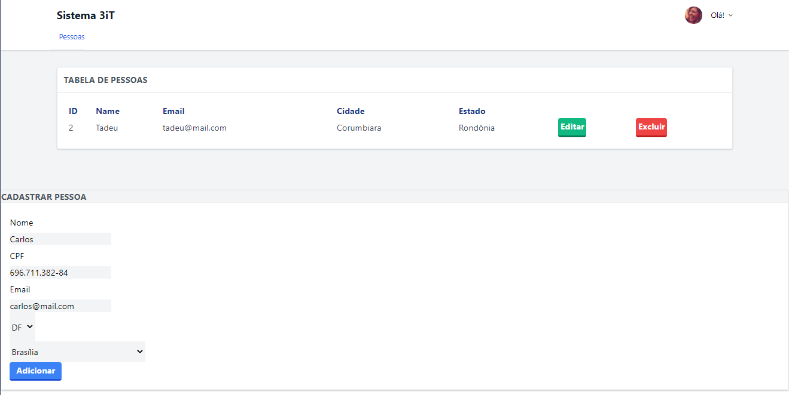

# Teste Front-End - 3IT
Criar uma aplicação com Angular e integrar com a API.

## Preview



### Requisitos: 
- [Node.js 8.11.3](https://nodejs.org/)
- [Java 11](https://www.oracle.com/br/java/technologies/javase/jdk11-archive-downloads.html)
- Banco de Dados: [PostgreSQL 14](https://www.postgresql.org/download/)
- Angular Core 7.3v

### Objetivos:

- [x] Lista de pessoas cadastradas
- [ ] Cadastrar nova pessoa com os campos Nome, CPF, Email, Estado, Cidade (somente via Insomnia)
  - [x] Os campos Estado e Cidade deverão ser listados do banco
- [ ] Editar os cadastros (somente via Insomnia e com problemas)
- [x] Excluir os cadastros

## Como executar o projeto?

1. Clone o repositório
```bash
git clone https://github.com/alessfm/api-teste-3it.git
cd api-teste-3it
```

2. Crie o banco de dados no seu sistema com o nome "api_teste".

3. Realize a Build (rodar o Maven).

> Recomenda-se instalar [extensões](https://marketplace.visualstudio.com/items?itemName=vscjava.vscode-java-pack) do Java na IDE (caso seja Visual Studio Code) para facilitar.

4. Com a API rodando, você pode acessar a
<a href="http://localhost:8080/swagger-ui/index.html"><strong>Documentação da API »</strong></a>

5. Por último, para executar o Angular, faça:
```bash
cd frontend
npm start
```

6. Acesse a página do Angular no [link](http://localhost:4200/) e pronto!